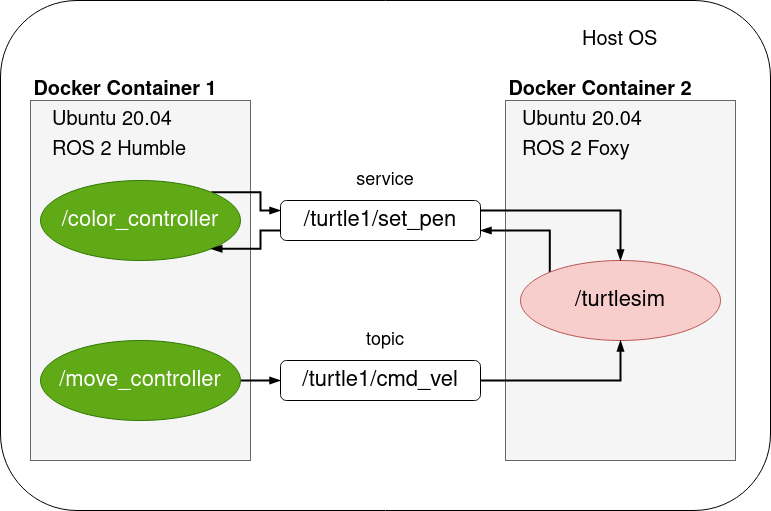

# Пример с использованием docker и docker-compose

В этом репозитории показано три способа межсетевого взаимодействия узлов ROS 2:

- без использования docker
- применяя для запуска узлов docker
- применяя для запуска узлов docker-compose

Для простого примера система ROS 2 будет состоять из 3 узлов:

- `/turtlesim` - симулятор для изучения ROS 
- `/move_controller` - узел управления движением черепахи
- `/color_controller` - узел, который меняет цвет линии, нарисованной черепахой

-------------
## В начале ...

Необходимо в начале установить Docker и Docker-Compose.

[Официальная инструкция](https://docs.docker.com/get-docker/) Docker, краткое изложение установки (для Linux):

```bash
sudo -E apt-get -y install apt-transport-https ca-certificates software-properties-common && \
curl -sL https://download.docker.com/linux/ubuntu/gpg | sudo apt-key add - && \
arch=$(dpkg --print-architecture) && \
sudo -E add-apt-repository "deb [arch=${arch}] https://download.docker.com/linux/ubuntu $(lsb_release -cs) stable" && \
sudo -E apt-get update && \
sudo -E apt-get -y install docker-ce docker-compose
```

```bash
sudo systemctl daemon-reload
sudo systemctl restart docker
```

## [Пример 1] Запуск без Docker


```bash
cd ros2_ws
colcon build

source /opt/ros/foxy/setup.bash
source install/setup.bash # полный путь может быть: ~/ros2_docker_examples/ros2_ws/install/setup.bash

ros2 launch my_turtle_bringup turtlesim_demo.launch.py
```

## [Пример 2] Запуск в одном контейнере


**Выполнять команды нужно находясь в ros2_docker_examples/каталоге:**

```
sudo chmod +x example1/ros_entrypoint.sh

docker build -t turtle_demo -f example1/Dockerfile .

xhost local:root

sudo docker run --rm -it \
--env DISPLAY \
--volume /tmp/.X11-unix:/tmp/.X11-unix:rw \
turtle_demo \
ros2 launch my_turtle_bringup turtlesim_demo.launch.py
```

## [Пример 3] Запуск в двух контейнерах (с использованием `docker-compose`)



```bash
cd example2
docker-compose up --build
```

